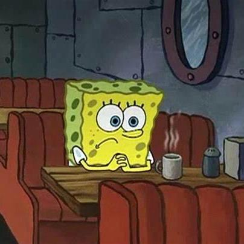

# Task Manger (Todo List)
### Description
**Date-Start**: 1403,07,17 - 2024,10,08 
**Date-End**: 1403,07,23 - 2024,10,14 
**Documentation**: [📄](https://rezaslm0.github.io/to-do-list/docs/jsdoc/index.html) 
**Live**: [🖥️](https://rezaslm0.github.io/to-do-list/src/index.html) 
**Description**:  
This is an exercise project for teacher [Amirhossein Khateri](https://ir.linkedin.com/in/amirhosseinkhateri) javascript course, in this project, people are supposed to create a web program in a group in the field of note app program or in todo lists.

### Group Member
&nbsp;&nbsp;&nbsp;&nbsp;&nbsp;
&nbsp;&nbsp;&nbsp;&nbsp;&nbsp;
&nbsp;&nbsp;&nbsp;&nbsp;&nbsp;

